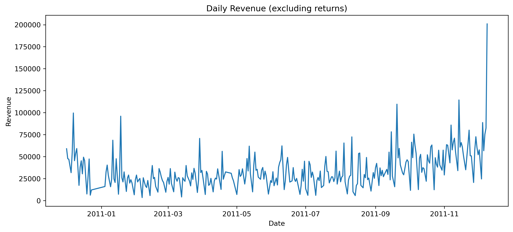
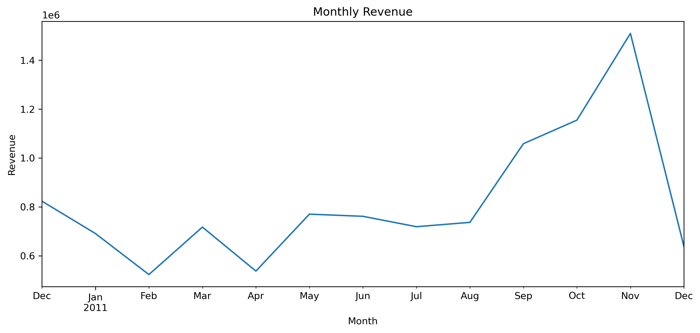
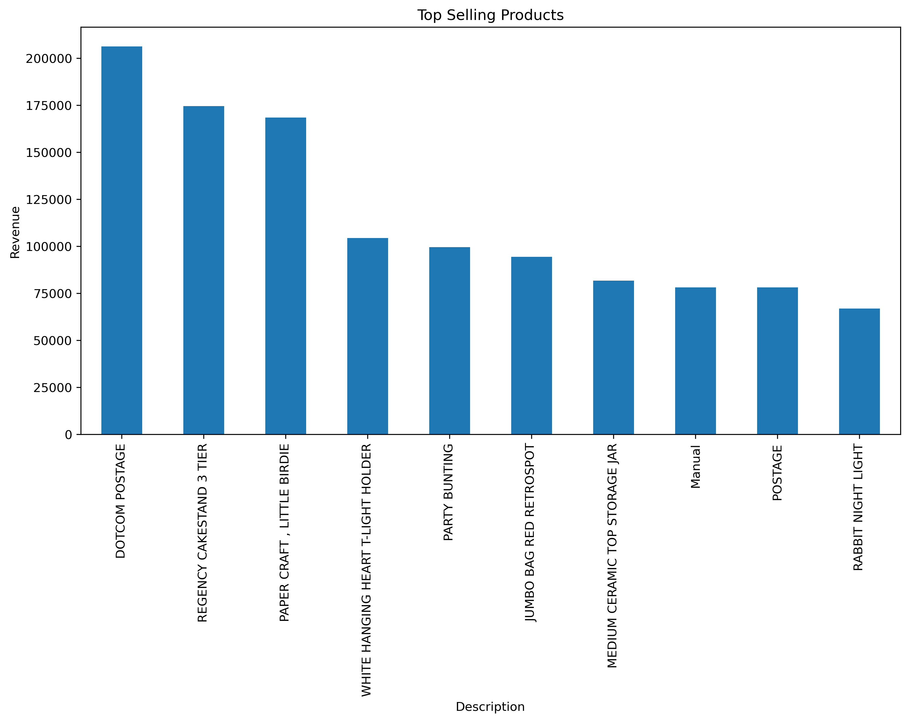
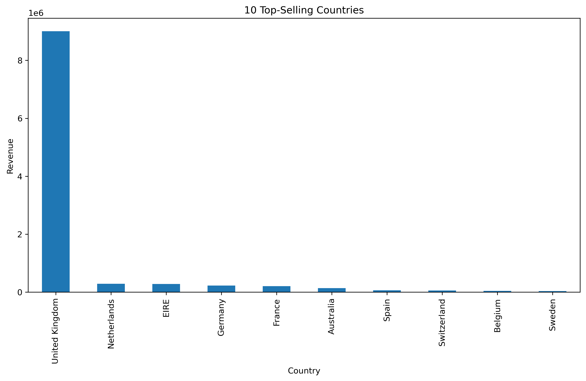

# 🛒 E-Commerce Analytics: Customer Segmentation & Forecasting

This project explores the **UCI Online Retail dataset** to perform end-to-end e-commerce analytics.  
The workflow includes **data cleaning, exploratory data analysis (EDA), customer segmentation (RFM analysis), market basket analysis, and forecasting**.  

The goal is to derive actionable insights into customer behavior, product performance, and revenue trends that can inform **marketing and business strategy**.

---

## 📂 Project Structure
ecommerce_analytics/
│
├── data/ # raw dataset
├── figures/ # saved plots for README & reports
├── 01_load_eda.ipynb # Data loading & exploratory analysis
├── 02_rfm_segmentation.ipynb # RFM segmentation (WIP - ignored in repo for now)
├── LICENSE
└── README.md

---

## 📘 Notebooks

- **01_load_eda.ipynb**  
  Loads the dataset, performs exploratory data analysis (EDA), and creates key revenue/product/customer insights.  
  - Data cleaning: handling missing values, type conversions  
  - Revenue analysis (daily, monthly)  
  - Top selling products and countries  

- **02_rfm_segmentation.ipynb** *(Work in progress, currently local only)*  
  Implements RFM (Recency, Frequency, Monetary) analysis to cluster customers by behavior and value.

- **03_market_basket_analysis.ipynb (Planned)**  
  Will apply association rule mining (Apriori / FP-Growth) to uncover which products are most frequently bought together (useful for cross-selling & recommendation systems).
  
- **04_forecasting.ipynb (Planned)**
  Will build forecasting models (ARIMA, Prophet, LSTM) to predict future revenue trends and support inventory/marketing planning.

---

## 📊 Results

Here are some of the visual insights generated so far:

<h3>Daily Revenue</h3>

<h3>Monthly Revenue</h3>

<h3>Top Selling Products</h3>

<h3>Top Selling Countries</h3>

---

## 🚀 Next Steps
- Complete **RFM Segmentation** notebook (02)  
- Build **Market Basket Analysis** (03) for product bundling insights  
- Implement **Forecasting Models** (04) for revenue prediction  
- Deploy dashboards or interactive visualizations  

---

## ⚙️ Tech Stack

- **Python**: pandas, numpy, matplotlib, seaborn  
- **Jupyter Notebooks** for reproducibility  
- **GitHub** for version control and documentation  

---

## 📜 License
This project is licensed under the MIT License.
